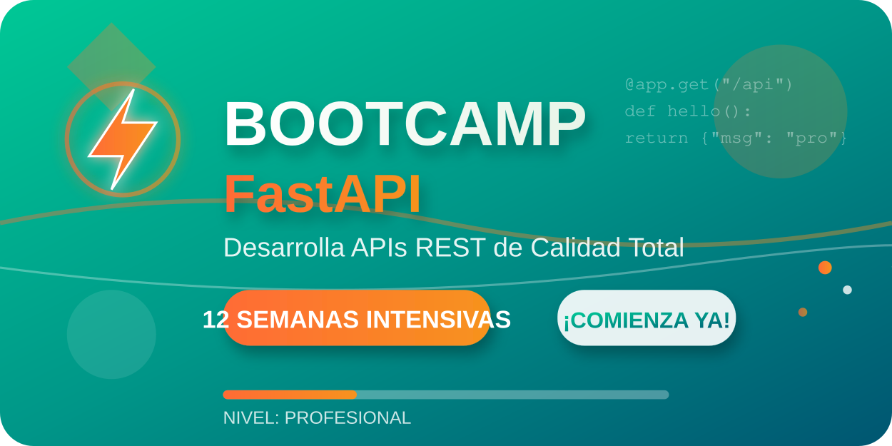

# Bootcamp bc-fastapi

<div align="center">
  


</div>


## 📋 Descripción del Proyecto

Bootcamp intensivo de desarrollo de **APIs REST con FastAPI** dirigido a aprendices de Tecnólogo en Desarrollo de Software (III trimestre). El programa tiene una duración de **11 semanas** con sesiones semanales de **6 horas exactas** (incluyendo break de 30 min), enfocado en la aplicación de mejores prácticas y desarrollo de software de **calidad total** con enfoque en conceptos fundamentales.

## 🚨 **ESTADO ACTUAL DEL BOOTCAMP**

### ✅ **Semanas Completamente Depuradas y Protegidas**

- **✅ Semana 1**: Introducción a FastAPI
- **✅ Semana 2**: Python Moderno para APIs
- **✅ Semana 3**: FastAPI Intermedio
- **✅ Semana 4**: Modelos y Validación
- **✅ Semana 5**: Base de Datos Básica
- **✅ Semana 6**: CRUD Completo
- **✅ Semana 7**: Autenticación Básica
- **✅ Semana 8**: Testing y Calidad
- **✅ Semana 9**: Containerización con Docker
- **✅ Gamificación**: [Sistema completo de incentivos y logros](./_docs/guides/gamification-strategy.md)

### 🔄 **En Proceso de Depuración**

- **⏳ Semana 10**: API Avanzada (WebSockets, Background Tasks)
- **⏳ Semana 11**: Proyecto Final Integración (Portfolio, Presentación)
- **📅 Próximas actualizaciones**: Las semanas se irán publicando conforme se complete su depuración

### 📢 **Importante**

> Todas las semanas completadas incluyen: teoría, prácticas (90 min c/u), ejercicios, proyecto y recursos.
> Contenido ajustado a **6 horas semanales exactas** con protección de solo lectura.

## 🚨 **IMPORTANTE: Restricciones y Expectativas**

### ⏰ **Limitación de Tiempo (CRÍTICA)**

- **6 horas semanales exactas** - No modificable (incluye break de 30 min)
- **Aprendices con conocimiento básico de Python**
- **Contenido ajustado para ser 100% realizable**
- **Enfoque en fundamentos**: Solo conceptos esenciales y fundamentales

### 🎯 **Expectativas Realistas**

- ✅ **Progreso constante y sostenible** cada semana
- ✅ **Experiencias de aprendizaje exitosas** desde día 1
- ✅ **Enfoque en calidad** más que cantidad
- ❌ **NO se espera dominio exhaustivo** en una sola semana

### 🎯 Objetivos del Bootcamp

- Desarrollar APIs REST **funcionales y bien estructuradas** con FastAPI
- Implementar **patrones básicos a intermedios** de arquitectura
- Aplicar **mejores prácticas fundamentales** de desarrollo
- Dominar **herramientas esenciales** del stack moderno
- Crear aplicaciones con **estándares profesionales básicos**

## 🛠️ Stack Tecnológico

### Backend Core

- **FastAPI** - Framework principal para APIs REST
- **Python 3.13+** - Lenguaje de programación
- **Pydantic** - Validación y serialización de datos
- **SQLAlchemy** - ORM para base de datos
- **Alembic** - Migraciones de base de datos

### Base de Datos

- **PostgreSQL 15** - Base de datos principal
- **SQLite** - Base de datos para desarrollo/testing
- **Redis 7** - Cache en memoria y almacenamiento de sesiones

### Containerización y DevOps

- **Docker** - Containerización de aplicaciones
- **Docker Compose** - Orquestación de servicios
- **GitHub Actions** - CI/CD pipelines

### Frontend (cuando se requiera)

- **React 19** - Biblioteca de interfaces de usuario
- **Vite** - Build tool y dev server
- **Tailwind CSS** - Framework de CSS utility-first
- **pnpm** - Gestor de paquetes

### Herramientas de Desarrollo

- **Postman** - Testing de APIs
- **Swagger/OpenAPI** - Documentación automática
- **SonarQube** - Análisis de calidad de código
- **pytest** - Framework de testing

## 📁 Estructura del Proyecto

```
bc-fastapi/
├── 📄 README.md                          # Documentación principal
├── 📄 LICENSE                            # Licencia MIT del proyecto
├── 📄 CHANGELOG.md                       # Registro de cambios
├── 📄 CODE_OF_CONDUCT.md                 # Código de conducta
├── 📄 CONTRIBUTING.md                    # Guía de contribución
├── 📄 ESTRUCTURA.md                      # Documentación de estructura
├── 📄 .gitignore                         # Archivos ignorados por Git
├── 📄 plan-trabajo-detallado.md          # Plan semanal detallado
├── 📁 assets/                            # 🎨 Recursos gráficos
│   ├── 📄 logo-bootcamp-fastapi.svg      # Logo principal (SVG)
│   ├── 📄 logo-bootcamp-fastapi.png      # Logo principal (PNG)
│   ├── 📄 logo-bootcamp-fastapi-compact.svg # Logo compacto (SVG)
│   ├── 📄 logo-bootcamp-fastapi-compact.png # Logo compacto (PNG)
│   └── 📄 logo-preview.html              # Preview de logos
├── 📁 .github/                           # 🔧 Configuración GitHub
│   ├── 📄 .copilot-instructions.md       # Instrucciones para Copilot
│   ├── 📄 PULL_REQUEST_TEMPLATE.md       # Template para PRs
│   └── 📁 ISSUE_TEMPLATE/                # Templates para issues
│       ├── 📄 bug_report.md              # Reporte de bugs
│       ├── 📄 feature_request.md         # Solicitud de features
│       ├── 📄 question.md                # Preguntas
│       └── 📄 config.yml                 # Configuración templates
├── 📁 _docs/                             # 📚 Documentación del proyecto
│   ├── 📁 setup/                         # Configuración inicial
│   │   ├── 📄 environment-setup.md       # Setup del entorno
│   │   ├── 📄 git-github-strategy.md     # Estrategia Git/GitHub
│   │   ├── 📄 entrega-guidelines.md      # Guías de entrega
│   │   └── 📄 automation-roadmap.md      # Roadmap de automatización
│   ├── 📁 guides/                        # Guías técnicas avanzadas
│   │   ├── 📄 security-best-practices.md # Mejores prácticas seguridad
│   │   ├── 📄 performance-optimization.md# Optimización performance
│   │   ├── 📄 api-design-standards.md    # Estándares diseño API
│   │   ├── 📄 deployment-devops.md       # Deployment y DevOps
│   │   ├── 📄 architecture-patterns.md   # Patrones arquitectura
│   │   ├── 📄 database-modeling.md       # Modelado de BD
│   │   ├── 📄 gamification-strategy.md   # Estrategia de gamificación
│   │   └── 📄 rubricas-evaluacion.md     # Rúbricas evaluación
│   ├── 📁 api/                           # Documentación API
│   ├── 📁 architecture/                  # Diagramas arquitectura
│   └── 📁 troubleshooting/               # Solución problemas
├── 📁 _scripts/                          # 🔧 Scripts de automatización
│   ├── 📁 setup/                         # Scripts configuración
│   ├── 📁 testing/                       # Scripts testing
│   ├── 📁 deployment/                    # Scripts deployment
│   └── 📁 utilities/                     # Utilidades generales
│       └── 📄 generate_week_gitkeeps.sh  # Generador .gitkeep
├── 📁 recursos-compartidos/              # 🗂️ Recursos compartidos
│   ├── 📁 configs/                       # Configuraciones
│   ├── 📁 templates/                     # Plantillas código
│   ├── 📁 databases/                     # Scripts BD
│   └── 📁 tools/                         # Herramientas
├── 📁 semana-01/ ⭐                      # 🎯 Semana 1: Fundamentos
│   ├── 📄 README.md                      # Objetivos y actividades
│   ├── � RUBRICA_SEMANA_1.md           # Rúbrica evaluación
│   ├── �📁 teoria/                        # Conceptos fundamentales
│   │   └── 📄 01-conceptos-fundamentales.md
│   ├── 📁 practica/                      # Tutoriales prácticos
│   │   ├── 📄 01-environment-setup.md    # Setup entorno desarrollo
│   │   ├── 📄 02-hello-world-api.md      # Primera API FastAPI
│   │   ├── 📄 03-python-fundamentals.md  # Fundamentos Python
│   │   ├── 📄 04-fastapi-basics.md       # Básicos FastAPI
│   │   └── 📁 04-fastapi-basics/         # Proyecto práctico
│   ├── 📁 ejercicios/                    # Ejercicios propuestos
│   ├── 📁 proyecto/                      # Especificaciones proyecto
│   └── 📁 recursos/                      # Referencias y diagramas
├── 📁 semana-02/                         # 🎯 Semana 2-12
├── 📁 semana-03/                         # (Estructura similar)
├── ...                                   # Semanas 4-11
├── 📁 semana-07/                         # 🎯 Semana 7: Autenticación Básica
├── 📁 semana-08/                         # 🎯 Semana 8: Testing y Calidad
├── 📁 semana-09/                         # 🎯 Semana 9: Containerización con Docker
├── ...                                   # Semanas 10-11
└── 📁 proyecto-final/                    # 🏆 Proyecto integrador
    ├── 📁 backend/                       # Backend FastAPI
    ├── 📁 frontend/                      # Frontend React
    ├── 📁 deployment/                    # Configuración deploy
    ├── 📁 docs/                          # Documentación proyecto
    └── 📁 tests/                         # Testing integral
```

### 📂 Estructura de Cada Semana

Cada directorio `semana-XX/` sigue la misma estructura organizacional:

```
semana-XX/
├── 📄 README.md                 # Objetivos y actividades semanales
├── 📄 RUBRICA_SEMANA_X.md      # Rúbrica de evaluación específica
├── 📁 teoria/                  # 📖 Conceptos teóricos
├── 📁 practica/                # 💻 Tutoriales paso a paso
├── 📁 ejercicios/              # 🏋️ Ejercicios propuestos
├── 📁 proyecto/                # 🎯 Especificaciones proyecto semanal
└── 📁 recursos/                # 📚 Referencias y materiales adicionales
```

## 🎓 Metodología de Enseñanza

### Principios Fundamentales

- **Calidad Total**: No hay "errores menores", todo problema es un PROBLEMA
- **Enfoque en Fundamentos**: Conceptos esenciales, máximo 6 horas semanales
- **Nomenclatura en Inglés**: Obligatorio para todo código técnico (functions, variables, endpoints, JSON keys)
- **Clean Architecture**: Separación clara de responsabilidades
- **Best Practices**: Aplicación constante de mejores prácticas
- **Estructura Numerada**: Organización clara y progresiva del contenido

### Formato Bootcamp

- **6 sesiones semanales** de 6 horas cada una (incluye break de 30 min)
- **Proyectos progresivos** que construyen sobre conocimientos previos
- **Evaluación continua** con feedback detallado
- **Proyecto final integrador** que demuestra dominio completo
- **Contenido estructurado** enfocado en lo esencial

### Criterios de Evaluación

- **Técnica (70%)**: Funcionamiento, calidad, best practices
- **Profesional (20%)**: Nomenclatura, documentación, Git workflow
- **Actitudinal (10%)**: Participación, growth mindset, colaboración

## 🎮 Sistema de Gamificación

El bootcamp incluye un **sistema completo de gamificación** diseñado para mantener la motivación y fomentar el aprendizaje colaborativo:

### 🏅 Elementos Clave

- **🌟 Badges por Habilidades**: 15+ logros técnicos específicos (FastAPI Novice, Type Master, Security Specialist, etc.)
- **🏆 Sistema de Puntos**: Recompensas por calidad de código, participación y colaboración
- **👥 Equipos Colaborativos**: Trabajo en equipos de 3-4 personas con rotación semanal
- **📈 Leaderboard Constructivo**: Enfoque en progreso personal y colaboración
- **🎁 Recompensas Tangibles**: Acceso a recursos premium, certificaciones y herramientas

### 🎯 Filosofía

- **Colaboración sobre competencia**: Fomentar ayuda mutua
- **Calidad sobre cantidad**: Premiar excelencia, no velocidad
- **Crecimiento personal**: Enfoque en mejora individual
- **Valores SENA integrados**: Respeto, responsabilidad, calidad y trabajo en equipo

**📋 Documentación completa**: [Estrategia de Gamificación](./_docs/guides/gamification-strategy.md)

## 🚀 Inicio Rápido

### Prerrequisitos

- Python 3.11 o superior
- Node.js 18 o superior (para frontend en semanas posteriores)
- Docker y Docker Compose
- Git
- Editor de código (recomendado: VS Code con extensiones Python y Docker)

### Configuración del Entorno

```bash
# Clonar el repositorio
git clone <repository-url>
cd bc-fastapi

# Crear entorno virtual de Python
python -m venv venv
source venv/bin/activate  # Linux/Mac
# o
venv\Scripts\activate     # Windows

# Instalar dependencias base
pip install fastapi uvicorn

# Verificar instalación
python -c "import fastapi; print('FastAPI:', fastapi.__version__)"
```

### Comenzar con Semana 1

```bash
# Navegar a la primera semana
cd semana-01

# Revisar objetivos y estructura
cat README.md

# Seguir tutoriales en orden:
# 1. practica/01-environment-setup.md
# 2. practica/02-hello-world-api.md
# 3. practica/03-python-fundamentals.md
# 4. practica/04-fastapi-basics.md
```

### Verificar Configuración

```bash
# Desde semana-01/practica/04-fastapi-basics/
cd app
pip install -r requirements.txt
uvicorn main:app --reload

# Verificar en: http://localhost:8000/docs
```

## 📋 Cronograma del Bootcamp

| Semana | Estado        | Tema Principal               | Tecnologías                        |
| ------ | ------------- | ---------------------------- | ---------------------------------- |
| 1      | ✅ Publicada  | Fundamentos y Configuración  | Python, FastAPI, Git, Docker       |
| 2      | ✅ Publicada  | FastAPI Fundamentals         | Pydantic, Swagger, Validation      |
| 3      | ✅ Publicada  | Validación y Estructura REST | Pydantic Advanced, HTTP Errors     |
| 4      | ✅ Publicada  | Bases de Datos con FastAPI   | SQLAlchemy, Alembic, PostgreSQL    |
| 5      | ✅ Publicada  | Autenticación y Autorización | JWT, OAuth2, Security, Roles       |
| 6      | ✅ Publicada  | CRUD Completo                | Advanced SQLAlchemy, Relations     |
| 7      | ✅ Publicada  | Autenticación Básica         | JWT, Security, Authentication      |
| 8      | ✅ Publicada  | Testing y Calidad            | pytest, TestClient, Coverage       |
| 9      | ✅ Publicada  | Containerización con Docker  | Docker, Compose, CI/CD, Monitoring |
| 10     | ⏳ En proceso | API Avanzada                 | WebSockets, Background Tasks       |
| 11     | ⏳ En proceso | Proyecto Final - Integración | Portfolio, Presentación, Demo      |

> **Nota**: Las semanas 1-9 están completamente depuradas y protegidas. Las semanas 10-11 serán publicadas progresivamente conforme se complete su depuración bajo los criterios establecidos.

## 📚 Documentación Adicional

La documentación completa está organizada en `_docs/` con las siguientes secciones:

### 🚀 Setup y Configuración (`_docs/setup/`)

- **`environment-setup.md`** - Configuración completa del entorno de desarrollo
- **`git-github-strategy.md`** - Estrategias Git/GitHub y flujos de trabajo
- **`entrega-guidelines.md`** - Guías para entregas y evaluaciones
- **`automation-roadmap.md`** - Roadmap de automatización y CI/CD

### 📖 Guías Técnicas Avanzadas (`_docs/guides/`)

- **`security-best-practices.md`** - Mejores prácticas de seguridad
- **`performance-optimization.md`** - Optimización de rendimiento
- **`api-design-standards.md`** - Estándares de diseño de APIs
- **`deployment-devops.md`** - Deployment y prácticas DevOps
- **`architecture-patterns.md`** - Patrones de arquitectura
- **`database-modeling.md`** - Modelado de bases de datos
- **`rubricas-evaluacion.md`** - Sistema de rúbricas y evaluación

### 📊 Otras Secciones

- **`_docs/api/`** - Documentación específica de APIs
- **`_docs/architecture/`** - Diagramas y documentación arquitectural
- **`_docs/troubleshooting/`** - Solución de problemas comunes

## 📋 Archivos Principales del Proyecto

### 🔧 Configuración y Gestión

- **`CHANGELOG.md`** - Registro detallado de cambios del proyecto
- **`CODE_OF_CONDUCT.md`** - Código de conducta para colaboradores
- **`CONTRIBUTING.md`** - Guía completa de contribución
- **`ESTRUCTURA.md`** - Documentación detallada de la estructura
- **`plan-trabajo-detallado.md`** - Plan semanal completo del bootcamp

### ⚙️ GitHub y Colaboración

- **`.github/.copilot-instructions.md`** - Instrucciones para GitHub Copilot
- **`.github/PULL_REQUEST_TEMPLATE.md`** - Template para Pull Requests
- **`.github/ISSUE_TEMPLATE/`** - Templates para issues (bugs, features, preguntas)

### 🛠️ Scripts y Automatización

- **`_scripts/utilities/generate_week_gitkeeps.sh`** - Generador automático de .gitkeep
- **`_scripts/setup/`** - Scripts de configuración inicial
- **`_scripts/testing/`** - Scripts para testing automatizado
- **`_scripts/deployment/`** - Scripts de deployment

### 🎯 Estado Actual: Semanas 1-8 Completadas

Las **Semanas 1-8** están completamente implementadas y publicadas con:

- ✅ **Objetivos y rúbricas definidos** (`README.md`, rúbricas de evaluación)
- ✅ **Tutoriales prácticos completos** (paso a paso estructurados)
- ✅ **Teoría fundamental** (conceptos base documentados)
- ✅ **Proyectos prácticos funcionales** (APIs con estructura profesional)
- ✅ **Ejercicios propuestos** y especificaciones de proyecto
- ✅ **Referencias y recursos** organizados
- ✅ **Nomenclatura técnica en inglés** (functions, variables, endpoints, JSON keys)
- ✅ **Contenido estructurado** (6 horas exactas incluye break 30 min)
- ✅ **Protección como solo lectura** (chmod -R 555)
- 🔄 **Diagramas visuales** (SVG preparados, pendientes de integración)
- ✅ **Sistema de gamificación** ([Estrategia completa de incentivos](./_docs/guides/gamification-strategy.md))

**Semanas 9-11**: En proceso de depuración siguiendo los mismos criterios.

## 🤝 Contribución

### Filosofía: "Manual Primero, Luego Altamente Productivo"

- **Primero**: Entender y hacer manualmente cada proceso
- **Segundo**: Automatizar solo cuando se domina el proceso manual
- **Siempre**: Mantener calidad total en cada entrega

### Convenciones de Código

- **Nomenclatura**: Obligatorio en inglés para todo elemento técnico
- **Python**: snake_case para funciones y variables, PascalCase para clases
- **JavaScript/React**: camelCase para variables, PascalCase para componentes
- **Documentación**: Español para explicaciones, inglés para código
- **Commits**: [Conventional Commits](https://www.conventionalcommits.org/en/v1.0.0/) format: `type(scope): description`
  - `feat: add user authentication endpoint`
  - `fix: resolve database connection issue`
  - `docs: update API documentation`
  - `test: add unit tests for user service`

### Flujo de Trabajo Git

```bash
# Crear rama para nueva característica
git checkout -b feature/descriptive-name

# Commits atómicos con conventional commits
git commit -m "feat(auth): add user authentication endpoint"
git commit -m "feat(auth): implement JWT token validation"

# Push y pull request
git push origin feature/descriptive-name
```

### Entrega de Proyectos

- **📍 GitHub Only**: Todas las entregas deben ser via GitHub
- **🔍 CI/CD**: Usar GitHub Actions desde día 1
- **📋 PR Templates**: Usar templates para Pull Requests
- **✅ Reviews**: Code review obligatorio para merge
- **📊 Quality Gates**: SonarQube y testing antes de deploy

Para más detalles, ver `_docs/setup/git-github-strategy.md` y `CONTRIBUTING.md`.

## 📞 Soporte y Recursos

### 📋 Documentación Principal

- **`README.md`** - Este archivo (información general)
- **`ESTRUCTURA.md`** - Documentación detallada de estructura
- **`plan-trabajo-detallado.md`** - Plan completo semana a semana
- **`CONTRIBUTING.md`** - Guía completa de contribución

### 🔧 Setup y Configuración

- **`_docs/setup/environment-setup.md`** - Configuración entorno desarrollo
- **`_docs/setup/git-github-strategy.md`** - Estrategias Git/GitHub
- **`_docs/setup/entrega-guidelines.md`** - Guías de entrega

### 📖 Guías Técnicas

- **`_docs/guides/`** - Guías avanzadas (seguridad, performance, arquitectura)
- **`semana-01/README.md`** - Ejemplo de estructura semanal

### 🐛 Reportar Problemas

- **GitHub Issues**: Usar templates en `.github/ISSUE_TEMPLATE/`
- **Bug Reports**: `bug_report.md`
- **Feature Requests**: `feature_request.md`
- **Preguntas**: `question.md`

### 📞 Contacto

#### 👨‍🏫 Instructor Principal

- **Nombre**: Erick Granados Torres
- **Experiencia**: 18+ años en SENA - Instructor Especializado
- **Institución**: CGMLTI Regional Distrito Capital
- **GitHub**: @elparchetipk
- **LinkedIn**: [linkedin.com/in/erickgranadostorres](https://linkedin.com/in/erickgranadostorres)

#### 📋 Canales de Soporte (Orden de Prioridad)

1. **GitHub Issues** (Principal): [Issues del Repositorio](https://github.com/elparchetipk/bc-fastapi/issues)
   - ✅ Siempre disponible
   - ✅ Historial permanente
   - ✅ Colaboración comunitaria
2. **Presencial**: Durante horarios de clase y asesorías programadas

- **Repositorio**: https://github.com/elparchetipk/bc-fastapi.git
- **Documentación**: `/bc-fastapi/_docs/`

## 📄 Licencia

Este proyecto es parte del programa educativo del Centro de Gestión de Mercados Logística y Tecnologías de la Información CGMLTI de la Regional Distrito Capital del Servicio Nacional de Aprendizaje SENA - Colombia y está destinado únicamente para fines académicos.

---

## 🏆 Objetivos de Aprendizaje

Al completar este bootcamp, los aprendices serán capaces de:

✅ **Desarrollar APIs REST** profesionales con FastAPI  
✅ **Implementar arquitectura limpia** y patrones de diseño  
✅ **Gestionar bases de datos** con ORMs y migraciones  
✅ **Containerizar aplicaciones** con Docker  
✅ **Aplicar testing** comprehensivo y análisis de calidad  
✅ **Integrar frontend** con React y tecnologías modernas  
✅ **Desplegar aplicaciones** con pipelines CI/CD  
✅ **Trabajar en equipo** con herramientas profesionales

---

<div align="center">

**¡Bienvenidos al Bootcamp bc-fastapi!**  
_Donde la calidad es total y la excelencia es el estándar._

</div>
