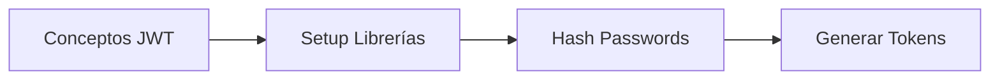
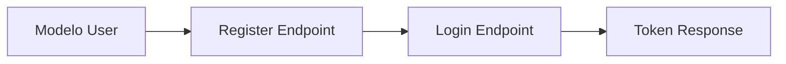
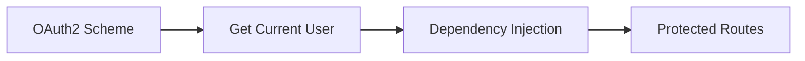
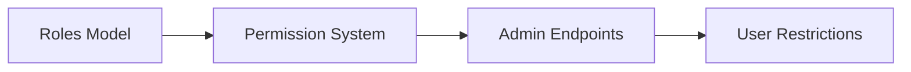

# Week 5: Basic Security & Simple Authentication

⏰ **TOTAL DURATION: 6 HOURS EXACTLY**  
📚 **LEVEL: Basic Security Concepts**

## 🚨 **IMPORTANT: Gentle Introduction to Security**

This week provides a **gentle introduction to API security concepts** without complex implementations. Students will learn basic security principles and simple authentication patterns.

- ✅ **Completely achievable in 6 hours**
- ✅ **Builds naturally from Week 4**
- ✅ **Focus on understanding over complex implementation**

## 🎯 Weekly Objectives (Fundamental)

After this 6-hour week (includes 30-min break), students will:

1. ✅ **Understand basic security concepts** (authentication vs authorization)
2. ✅ **Implement simple API key authentication**
3. ✅ **Add basic user validation** to endpoints
4. ✅ **Understand password security basics** (hashing concepts)
5. ✅ **Protect endpoints with simple checks**

### ❌ **What we DON'T expect to master this week**

- JWT (JSON Web Tokens) - too complex for now
- OAuth2 implementation
- Database-based user management
- Complex role-based systems
- Production-grade security

## ⏱️ **6-Hour Structure (Includes 30-min Break)**

### **Block 1: Security Concepts & API Keys (75 min)**

- **14-security-basics.md**
- Understanding authentication vs authorization
- Simple API key implementation
- Basic security headers

### **☕ MANDATORY BREAK (30 min)**

- Rest to absorb security concepts
- Time to resolve API key doubts
- Mental preparation for user validation

### **Block 2: Simple User Validation (120 min)**

- **15-simple-users.md**
- In-memory user storage
- Basic password handling (concepts only)
- Simple login logic

### **Block 3: Endpoint Protection (90 min)**

- **16-endpoint-protection.md**
- Protecting endpoints with simple checks
- User-specific data access
- Basic authorization patterns

### **Block 4: Integration & Practice (45 min)**

- Consolidating security concepts
- Testing protected endpoints
- Preparing deliverable

## 📚 Week Content (Only Essentials)

### **🧭 Ordered Navigation (Follow this order)**

1. **[🧭 1-teoria/](./1-teoria/)** - Basic security concepts
2. **[💻 2-practica/](./2-practica/)** - Simple implementation
3. **[🎯 3-ejercicios/](./3-ejercicios/)** - Security practice
4. **[🚀 4-proyecto/](./4-proyecto/)** - Protected API
5. **[📚 5-recursos/](./5-recursos/)** - Basic references

### 🛠️ **Practices (Core of the week)**

1. **[14-security-basics.md](./2-practica/14-security-basics.md)** - API keys & concepts
2. **[15-simple-users.md](./2-practica/15-simple-users.md)** - Basic user handling
3. **[16-endpoint-protection.md](./2-practica/16-endpoint-protection.md)** - Simple protection

### � **Theory (Minimal)**

- Authentication vs Authorization concepts
- API key patterns
- Basic password security awareness

### 🏋️ **Exercises (Consolidation)**

- 2 simple security exercises
- API key testing
- Basic protection verification

## 🚀 **Prerequisites (From Week 4)**

- ✅ CRUD API with query parameters working
- ✅ Pydantic validation implemented
- ✅ File operations basic understanding
- ✅ Search endpoints functional

## 🎯 Success Criteria for the Week

### ✅ **Success Criteria (Pass)**

- [ ] At least 1 API key protected endpoint working
- [ ] Basic user concept implemented (in-memory)
- [ ] Simple endpoint protection functioning
- [ ] Understanding of authentication vs authorization concepts

### 🌟 **Optional Bonus (No pressure)**

- [ ] Multiple protected endpoints
- [ ] Simple user roles (admin/user)
- [ ] Basic password validation

---

## 📋 Week Deliverables

### 🔧 **Main Deliverable (Only Required)**

**API with Basic Security**

- ✅ Week 4 API + basic security additions
- ✅ At least 1 API key protected endpoint
- ✅ Simple user validation implementation
- ✅ Basic authentication concepts demonstrated

### 📄 **Documentation Deliverable (Minimum)**

**Updated README.md**

- ✅ Description of security features added
- ✅ Example of how to use API keys
- ✅ 2-3 sentence reflection on security learning

### 🎯 **Delivery Format**

1. **Updated GitHub repository** with:

   - main.py with basic security features
   - requirements.txt updated if needed
   - README.md with security documentation

2. **No video required**

### ⏰ **Delivery Date**

- **At the end of the 6-hour session**
- **Immediate delivery, no homework**

## 📊 Simplified Evaluation

Evaluation focuses on **basic security understanding**:

- **Security Implementation (70%)**: Do protected endpoints work?
- **Conceptual Understanding (20%)**: Clear grasp of auth vs authz?
- **Delivery (10%)**: Updated in GitHub?

### 🏆 Approval Criteria

- **✅ Approved**: Basic security features working + code in GitHub
- **❌ Pending**: Additional support in next session

## 🎁 Bonus Opportunities (Only if extra time)

- **Multiple security methods**: +5 points
- **Simple user roles**: +3 points
- **Security best practices**: +2 points

## 📅 6-Hour Schedule

| Time        | Activity                     | Duration | Cumulative |
| ----------- | ---------------------------- | -------- | ---------- |
| 9:00-10:15  | Security concepts & API keys | 75 min   | 75 min     |
| 10:15-10:45 | **☕ MANDATORY BREAK**       | 30 min   | 105 min    |
| 10:45-12:45 | Simple user validation       | 120 min  | 225 min    |
| 12:45-14:15 | Endpoint protection          | 90 min   | 315 min    |
| 14:15-15:00 | Integration and delivery     | 45 min   | 360 min    |

**Total**: Exactly 6 hours (360 minutes)

## 🔍 Delivery Structure

### 📁 Expected Structure

```
lastname-firstname-week5/
├── README.md               # With basic security documentation
├── requirements.txt        # Updated if new dependencies
└── main.py                # API with basic security features
```

### 🚀 Simple Delivery Process

1. **Evolve existing repository**

   - Add basic security to main.py
   - Update README with security features
   - Commit with descriptive message

2. **In-Class Demonstration**

   - Show protected endpoint working
   - Demonstrate API key usage
   - Show updated /docs with security

3. **Deadline**
   - **At the end of 6-hour class**
   - **No extensions**

## 🤝 Support Resources

### 👥 In-Class Help

- **Instructor**: Available throughout the session
- **Peers**: Collaborative work allowed
- **Documentation**: Basic security patterns + HTTP headers

### 🔧 Basic Tools

- **Same tools from Week 4**
- **Postman/Thunder Client**: For testing API keys
- **Browser**: For /docs with security features

## 🎯 Preparation for Week 6

With basic security working, in Week 6 you'll learn:

- **Database integration**: Simple user storage
- **Session management**: Basic state handling
- **Production basics**: Deployment concepts

## 📞 Contact (Emergencies Only)

- **During class**: Raise hand or chat
- **Outside hours**: Not required, everything resolved in class

---

## 🌟 Final Motivation Message

This fifth week introduces you to **essential security concepts**. With basic authentication, your API starts to become a real-world application.

**Remember**:

- ✅ Build on solid progress from Weeks 1-4
- ✅ The 30-min break is mandatory for concept absorption
- ✅ Security is fundamental for any real API
- ✅ Concepts will apply in all following weeks

**Your API is becoming professional! 🔒**



### **Bloque 2: Login System (90 min)**



### **Bloque 3: Protección (90 min)**



### **Bloque 4: Autorización (90 min)**



---

## 🎯 Objetivos de Aprendizaje Detallados

### **🔐 Conceptual (Teoría - 30 min)**

- **Diferencia entre Autenticación vs Autorización**
- **JWT: estructura, claims, expiración**
- **Password hashing: bcrypt, salt, rainbow tables**
- **OAuth2 flow básico**
- **Principios de seguridad en APIs**

### **💻 Práctico (Implementación - 5.5 horas)**

- **Configurar sistema JWT** completo
- **Crear endpoints** de registro y login
- **Implementar middleware** de autenticación
- **Proteger rutas** sensibles
- **Gestionar roles** y permisos básicos

### **🧠 Aplicado (Ejercicios y Proyecto)**

- **Ejercicios progresivos** de seguridad
- **Proyecto integrador** con autenticación completa
- **Cases studies** de vulnerabilidades comunes
- **Best practices** aplicadas

---

## 📋 Pre-requisitos Verificados

### **✅ Conocimientos Requeridos**

- [x] **FastAPI básico** (Semanas 1-3)
- [x] **SQLAlchemy y BD** (Semana 4)
- [x] **Pydantic models** (Semanas 2-4)
- [x] **HTTP methods y status codes** (Semana 3)
- [x] **Testing básico** (Semana 4)

### **⚠️ Si no tienes estos conocimientos**

- Revisar semanas anteriores
- Completar exercises de refuerzo
- Consultar con instructores

---

## 🚀 Hacia el Futuro

### **🔗 Conexión con Semanas Anteriores**

- **Builds upon**: Toda la base de FastAPI + SQLAlchemy
- **Integrates**: Usuarios de BD con sistema de autenticación
- **Extends**: APIs REST con seguridad profesional

### **🎯 Preparación para Siguiente Nivel**

- **Semana 6**: Testing avanzado y deployment
- **Semana 7**: Performance y monitoring
- **Semana 8**: Containerización con Docker
- **Futuro**: OAuth2 social, microservicios seguros

---

## 📊 Evaluación y Entregables

### **🎯 Al Final de la Semana**

**Debes ser capaz de:**

- [x] Explicar diferencia entre autenticación y autorización
- [x] Implementar sistema JWT completo
- [x] Crear endpoints de login/register seguros
- [x] Proteger rutas con middleware
- [x] Gestionar roles básicos de usuario
- [x] Aplicar buenas prácticas de seguridad

### **📦 Entregables**

1. **API con autenticación** funcionando
2. **Sistema de roles** implementado
3. **Tests de seguridad** pasando
4. **Documentación** de endpoints protegidos
5. **Proyecto integrador** con auth completo

---

## ⚡ Quick Start

### **🚀 Setup Rápido (5 min)**

```bash
# 1. Instalar dependencias
pip install python-jose[cryptography] passlib[bcrypt]

# 2. Actualizar requirements.txt
echo "python-jose[cryptography]==3.3.0" >> requirements.txt
echo "passlib[bcrypt]==1.7.4" >> requirements.txt

# 3. Crear variables de entorno
echo "SECRET_KEY=your-secret-key-here" > .env
echo "ALGORITHM=HS256" >> .env
echo "ACCESS_TOKEN_EXPIRE_MINUTES=30" >> .env

# 4. Listo para empezar!
```

### **📖 Orden de Estudio Recomendado**

1. **Leer teoría** (30 min) - Conceptos fundamentales
2. **Práctica 15** (90 min) - JWT y hashing
3. **Práctica 16** (90 min) - Login system
4. **Práctica 17** (90 min) - Protección endpoints
5. **Práctica 18** (90 min) - Roles y autorización
6. **Ejercicios** (60 min) - Refuerzo y casos edge
7. **Proyecto** (4-6 horas) - Integración completa

---

## 💡 Tips para el Éxito

1. **🔒 Seguridad first**: Nunca comprometas la seguridad por simplicidad
2. **🧪 Test everything**: Especialmente endpoints de autenticación
3. **📖 Lee la documentación**: JWT y OAuth2 tienen muchos detalles
4. **🔑 Maneja secretos**: Usa variables de entorno siempre
5. **⚠️ Error handling**: Mensajes de error seguros y útiles

---

## 🆘 Soporte y Ayuda

- **🎓 Instructor**: Consultas durante office hours
- **👥 Compañeros**: Pair programming en exercises
- **📚 Documentación**: FastAPI Security docs
- **🌐 Comunidad**: Stack Overflow, Reddit r/FastAPI
- **📞 Emergencias**: Slack del bootcamp

---

**¡Prepárate para crear APIs seguras y profesionales! 🔐✨**
