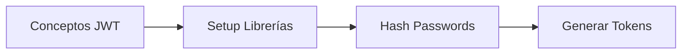
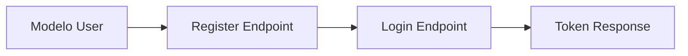
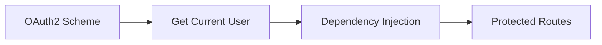
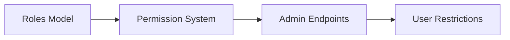

# Semana 5: Autenticación y Autorización

## 🎯 Objetivos de la Semana

Al finalizar esta semana, los estudiantes podrán:

- **Implementar autenticación JWT** con FastAPI y SQLAlchemy
- **Crear sistemas de login/logout** seguros
- **Proteger endpoints** con middleware de autenticación
- **Manejar roles y permisos** básicos de autorización
- **Aplicar buenas prácticas** de seguridad en APIs

## ⏱️ Distribución de Tiempo (6 horas total)

| Bloque | Actividad                    | Tiempo | Descripción                           |
| ------ | ---------------------------- | ------ | ------------------------------------- |
| **1**  | Fundamentos de Autenticación | 90 min | JWT, hashing, setup inicial           |
| **2**  | Sistema de Login/Register    | 90 min | Endpoints de autenticación            |
| **3**  | Protección de Endpoints      | 90 min | Middleware, dependencies, decoradores |
| **4**  | Roles y Autorización         | 90 min | Permisos, RBAC básico                 |

## 📚 Contenido de la Semana

### **📋 Navegación Ordenada (Seguir este orden)**

1. **[🧭 1-teoria/](./1-teoria/)** - Conceptos de seguridad y autenticación
2. **[💻 2-practica/](./2-practica/)** - Implementación JWT y protección
3. **[🎯 3-ejercicios/](./3-ejercicios/)** - Ejercicios de seguridad
4. **[🚀 4-proyecto/](./4-proyecto/)** - Sistema de autenticación completo
5. **[📚 5-recursos/](./5-recursos/)** - Referencias y herramientas

### **🧭 Teoría**

- [🔐 Autenticación y Autorización en APIs](./1-teoria/auth-concepts.md)

### **💻 Prácticas**

1. [🔧 JWT y Hashing de Passwords](./2-practica/15-jwt-setup.md) _(90 min)_
2. [🚪 Sistema de Login y Register](./2-practica/16-login-system.md) _(90 min)_
3. [🛡️ Protección de Endpoints](./2-practica/17-endpoint-protection.md) _(90 min)_
4. [👥 Roles y Autorización](./2-practica/18-roles-authorization.md) _(90 min)_

### **💪 Ejercicios**

- [🔒 Ejercicios de Seguridad](./3-ejercicios/ejercicios-seguridad.md)

### **🚀 Proyecto**

- [🏪 E-commerce con Autenticación](./4-proyecto/especificacion-auth.md)

### **📚 Recursos**

- [📖 Guías y Referencias](./5-recursos/recursos-seguridad.md)

---

## 🎓 Competencias que Desarrollarás

### **Nivel Principiante → Intermedio**

**Al inicio de la semana sabes:**

- FastAPI básico y endpoints
- Bases de datos con SQLAlchemy
- Modelos Pydantic
- CRUD operations

**Al final de la semana dominarás:**

- ✅ **JWT (JSON Web Tokens)** - Creación y validación
- ✅ **Password Hashing** - Seguridad de contraseñas
- ✅ **Autenticación Stateless** - Sin sesiones servidor
- ✅ **Middleware de Seguridad** - Protección automática
- ✅ **Dependency Injection** - Para autenticación
- ✅ **RBAC Básico** - Roles y permisos
- ✅ **Buenas Prácticas** - Seguridad en APIs

---

## 🔒 Tecnologías y Librerías

### **Stack de Seguridad**

- **JWT**: `python-jose[cryptography]` - Tokens seguros
- **Hashing**: `passlib[bcrypt]` - Encriptación de passwords
- **OAuth2**: FastAPI OAuth2PasswordBearer - Estándar de autenticación
- **Pydantic**: Validación de tokens y usuarios
- **SQLAlchemy**: Gestión de usuarios en BD

### **Herramientas de Testing**

- **pytest**: Testing de endpoints protegidos
- **httpx**: Cliente para tests de autenticación
- **Postman/Thunder Client**: Testing manual de JWT

---

## 🗺️ Roadmap de Aprendizaje

### **Bloque 1: Fundamentos (90 min)**



### **Bloque 2: Login System (90 min)**



### **Bloque 3: Protección (90 min)**



### **Bloque 4: Autorización (90 min)**



---

## 🎯 Objetivos de Aprendizaje Detallados

### **🔐 Conceptual (Teoría - 30 min)**

- **Diferencia entre Autenticación vs Autorización**
- **JWT: estructura, claims, expiración**
- **Password hashing: bcrypt, salt, rainbow tables**
- **OAuth2 flow básico**
- **Principios de seguridad en APIs**

### **💻 Práctico (Implementación - 5.5 horas)**

- **Configurar sistema JWT** completo
- **Crear endpoints** de registro y login
- **Implementar middleware** de autenticación
- **Proteger rutas** sensibles
- **Gestionar roles** y permisos básicos

### **🧠 Aplicado (Ejercicios y Proyecto)**

- **Ejercicios progresivos** de seguridad
- **Proyecto integrador** con autenticación completa
- **Cases studies** de vulnerabilidades comunes
- **Best practices** aplicadas

---

## 📋 Pre-requisitos Verificados

### **✅ Conocimientos Requeridos**

- [x] **FastAPI básico** (Semanas 1-3)
- [x] **SQLAlchemy y BD** (Semana 4)
- [x] **Pydantic models** (Semanas 2-4)
- [x] **HTTP methods y status codes** (Semana 3)
- [x] **Testing básico** (Semana 4)

### **⚠️ Si no tienes estos conocimientos**

- Revisar semanas anteriores
- Completar exercises de refuerzo
- Consultar con instructores

---

## 🚀 Hacia el Futuro

### **🔗 Conexión con Semanas Anteriores**

- **Builds upon**: Toda la base de FastAPI + SQLAlchemy
- **Integrates**: Usuarios de BD con sistema de autenticación
- **Extends**: APIs REST con seguridad profesional

### **🎯 Preparación para Siguiente Nivel**

- **Semana 6**: Testing avanzado y deployment
- **Semana 7**: Performance y monitoring
- **Semana 8**: Containerización con Docker
- **Futuro**: OAuth2 social, microservicios seguros

---

## 📊 Evaluación y Entregables

### **🎯 Al Final de la Semana**

**Debes ser capaz de:**

- [x] Explicar diferencia entre autenticación y autorización
- [x] Implementar sistema JWT completo
- [x] Crear endpoints de login/register seguros
- [x] Proteger rutas con middleware
- [x] Gestionar roles básicos de usuario
- [x] Aplicar buenas prácticas de seguridad

### **📦 Entregables**

1. **API con autenticación** funcionando
2. **Sistema de roles** implementado
3. **Tests de seguridad** pasando
4. **Documentación** de endpoints protegidos
5. **Proyecto integrador** con auth completo

---

## ⚡ Quick Start

### **🚀 Setup Rápido (5 min)**

```bash
# 1. Instalar dependencias
pip install python-jose[cryptography] passlib[bcrypt]

# 2. Actualizar requirements.txt
echo "python-jose[cryptography]==3.3.0" >> requirements.txt
echo "passlib[bcrypt]==1.7.4" >> requirements.txt

# 3. Crear variables de entorno
echo "SECRET_KEY=your-secret-key-here" > .env
echo "ALGORITHM=HS256" >> .env
echo "ACCESS_TOKEN_EXPIRE_MINUTES=30" >> .env

# 4. Listo para empezar!
```

### **📖 Orden de Estudio Recomendado**

1. **Leer teoría** (30 min) - Conceptos fundamentales
2. **Práctica 15** (90 min) - JWT y hashing
3. **Práctica 16** (90 min) - Login system
4. **Práctica 17** (90 min) - Protección endpoints
5. **Práctica 18** (90 min) - Roles y autorización
6. **Ejercicios** (60 min) - Refuerzo y casos edge
7. **Proyecto** (4-6 horas) - Integración completa

---

## 💡 Tips para el Éxito

1. **🔒 Seguridad first**: Nunca comprometas la seguridad por simplicidad
2. **🧪 Test everything**: Especialmente endpoints de autenticación
3. **📖 Lee la documentación**: JWT y OAuth2 tienen muchos detalles
4. **🔑 Maneja secretos**: Usa variables de entorno siempre
5. **⚠️ Error handling**: Mensajes de error seguros y útiles

---

## 🆘 Soporte y Ayuda

- **🎓 Instructor**: Consultas durante office hours
- **👥 Compañeros**: Pair programming en exercises
- **📚 Documentación**: FastAPI Security docs
- **🌐 Comunidad**: Stack Overflow, Reddit r/FastAPI
- **📞 Emergencias**: Slack del bootcamp

---

**¡Prepárate para crear APIs seguras y profesionales! 🔐✨**
