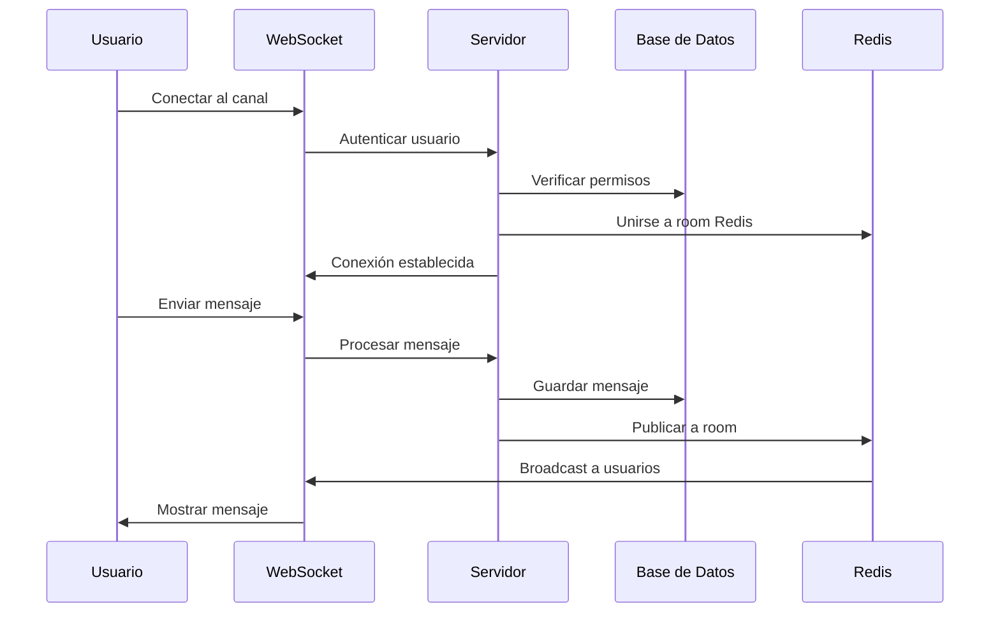
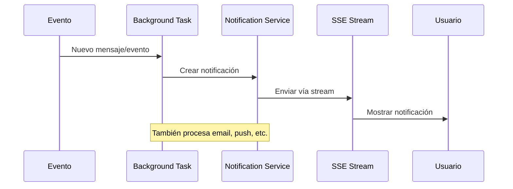
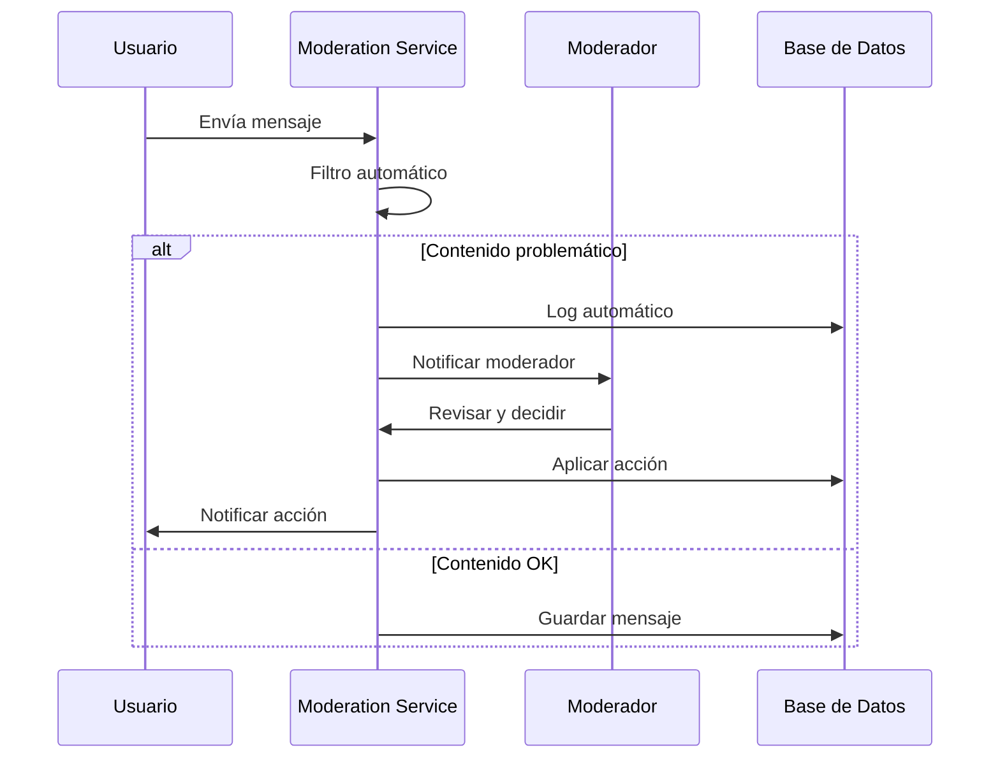

# Especificación Técnica - Sistema de Chat Empresarial

## 📋 Descripción General

Desarrollar un **sistema de chat empresarial completo** que permita a equipos colaborar en tiempo real con características avanzadas de administración, moderación y analytics.

---

## 🏗️ Arquitectura del Sistema

### **Diagrama de Componentes**

```text
┌─────────────────┐    ┌─────────────────┐    ┌─────────────────┐
│   Frontend      │    │   Backend       │    │   Database      │
│                 │    │                 │    │                 │
│ • Chat UI       │◄──►│ • FastAPI       │◄──►│ • PostgreSQL    │
│ • Dashboard     │    │ • WebSockets    │    │ • Redis Cache   │
│ • Admin Panel   │    │ • SSE Streams   │    │ • File Storage  │
└─────────────────┘    └─────────────────┘    └─────────────────┘
         │                       │
         │              ┌─────────────────┐
         │              │ Background      │
         └──────────────►│ Tasks           │
                        │ • Notifications │
                        │ • File Processing│
                        │ • Analytics     │
                        └─────────────────┘
```

### **Stack Tecnológico Detallado**

#### **Backend Core**

- **FastAPI 0.104+**: Framework principal
- **WebSockets**: Comunicación en tiempo real
- **Server-Sent Events**: Dashboard streaming
- **Background Tasks**: Procesamiento asíncrono
- **SQLAlchemy 2.0**: ORM para base de datos
- **Alembic**: Migraciones de DB

#### **Base de Datos**

- **PostgreSQL 15+**: Base de datos principal
- **Redis 7+**: Cache, sesiones, pub/sub
- **MinIO/S3**: Almacenamiento de archivos

#### **Autenticación y Seguridad**

- **JWT**: Tokens de acceso y refresh
- **bcrypt**: Hashing de contraseñas
- **OAuth2**: Integración con providers externos
- **Rate Limiting**: Protección contra abuse

#### **Frontend**

- **HTML5/CSS3**: Estructura y estilos
- **JavaScript ES6+**: Lógica del cliente
- **WebSocket API**: Comunicación en tiempo real
- **EventSource API**: Recepción de SSE
- **Chart.js**: Visualización de datos

---

## 📊 Modelo de Datos

### **Entidades Principales**

```python
# Modelo de usuarios y organizaciones
class Organization(Base):
    id: int
    name: str
    domain: str  # ej: "empresa.com"
    subscription_plan: str
    created_at: datetime
    is_active: bool

class User(Base):
    id: int
    email: str
    username: str
    password_hash: str
    organization_id: int
    role: UserRole  # admin, moderator, member
    profile_picture: str
    status: UserStatus  # online, away, busy, offline
    last_activity: datetime
    created_at: datetime
    is_active: bool

# Modelo de canales y mensajes
class Channel(Base):
    id: int
    name: str
    description: str
    organization_id: int
    type: ChannelType  # public, private, direct
    created_by: int
    created_at: datetime
    is_archived: bool

class Message(Base):
    id: int
    content: str
    channel_id: int
    user_id: int
    message_type: MessageType  # text, image, file, system
    reply_to_id: int  # Para hilos/replies
    created_at: datetime
    edited_at: datetime
    is_deleted: bool

class MessageAttachment(Base):
    id: int
    message_id: int
    filename: str
    file_url: str
    file_size: int
    mime_type: str

# Modelo de moderación
class ModerationAction(Base):
    id: int
    user_id: int  # Usuario afectado
    moderator_id: int  # Moderador que aplicó la acción
    action_type: str  # mute, ban, warning
    reason: str
    duration: timedelta
    expires_at: datetime
    created_at: datetime

class MessageReport(Base):
    id: int
    message_id: int
    reported_by: int
    reason: str
    status: str  # pending, resolved, dismissed
    reviewed_by: int
    created_at: datetime
```

### **Relaciones Clave**

- Usuario ←→ Organización (Many-to-One)
- Canal ←→ Organización (Many-to-One)
- Mensaje ←→ Canal (Many-to-One)
- Mensaje ←→ Usuario (Many-to-One)
- Usuario ←→ Canal (Many-to-Many) - Membresías

---

## 🔌 API Endpoints

### **Autenticación**

```python
POST /auth/login
POST /auth/logout
POST /auth/refresh
POST /auth/register
GET  /auth/me
```

### **Usuarios**

```python
GET    /users/
GET    /users/{user_id}
PUT    /users/{user_id}
DELETE /users/{user_id}
GET    /users/online
POST   /users/{user_id}/status
```

### **Canales**

```python
GET    /channels/
POST   /channels/
GET    /channels/{channel_id}
PUT    /channels/{channel_id}
DELETE /channels/{channel_id}
POST   /channels/{channel_id}/join
POST   /channels/{channel_id}/leave
GET    /channels/{channel_id}/members
```

### **Mensajes**

```python
GET    /channels/{channel_id}/messages
POST   /channels/{channel_id}/messages
PUT    /messages/{message_id}
DELETE /messages/{message_id}
GET    /messages/search
POST   /messages/{message_id}/report
```

### **WebSockets**

```python
WS /ws/chat/{channel_id}          # Chat en tiempo real
WS /ws/notifications/{user_id}    # Notificaciones personales
```

### **Server-Sent Events**

```python
GET /sse/dashboard                # Dashboard administrativo
GET /sse/activity/{channel_id}    # Actividad de canal
```

### **Administración**

```python
GET  /admin/stats
GET  /admin/users
POST /admin/moderation/actions
GET  /admin/reports
PUT  /admin/reports/{report_id}
```

---

## 🔄 Flujos de Trabajo Principales

### **1. Flujo de Chat en Tiempo Real**



### **2. Flujo de Notificaciones**



### **3. Flujo de Moderación**



---

## 💻 Características Técnicas Detalladas

### **WebSockets Implementation**

```python
# Ejemplo de manejo avanzado de WebSockets
class ChannelManager:
    def __init__(self):
        self.connections: Dict[int, Set[WebSocket]] = {}
        self.user_channels: Dict[int, Set[int]] = {}

    async def join_channel(self, channel_id: int, user_id: int, websocket: WebSocket):
        """Usuario se une a un canal"""
        if channel_id not in self.connections:
            self.connections[channel_id] = set()

        self.connections[channel_id].add(websocket)

        if user_id not in self.user_channels:
            self.user_channels[user_id] = set()
        self.user_channels[user_id].add(channel_id)

    async def broadcast_to_channel(self, channel_id: int, message: dict, exclude_user: int = None):
        """Enviar mensaje a todos en el canal"""
        if channel_id not in self.connections:
            return

        message_json = json.dumps(message)
        disconnected = set()

        for websocket in self.connections[channel_id]:
            try:
                await websocket.send_text(message_json)
            except ConnectionClosedError:
                disconnected.add(websocket)

        # Limpiar conexiones cerradas
        self.connections[channel_id] -= disconnected
```

### **Background Tasks para Notificaciones**

```python
# Sistema de notificaciones avanzado
class NotificationService:
    def __init__(self):
        self.templates = {
            "new_message": "📩 Nuevo mensaje de {username} en #{channel}",
            "mention": "🏷️ {username} te mencionó en #{channel}",
            "channel_invite": "🎉 Te invitaron al canal #{channel}"
        }

    async def process_message_notifications(self, message: Message):
        """Procesar notificaciones para un mensaje"""
        channel = await get_channel(message.channel_id)
        sender = await get_user(message.user_id)

        # Notificar a miembros del canal (excepto sender)
        members = await get_channel_members(channel.id)

        for member in members:
            if member.id != sender.id:
                await self.create_notification(
                    user_id=member.id,
                    type="new_message",
                    data={
                        "message_id": message.id,
                        "channel_id": channel.id,
                        "sender": sender.username,
                        "channel_name": channel.name
                    }
                )

        # Procesar menciones (@usuario)
        mentions = extract_mentions(message.content)
        for mentioned_user in mentions:
            await self.create_notification(
                user_id=mentioned_user.id,
                type="mention",
                priority="high",
                data={
                    "message_id": message.id,
                    "channel_id": channel.id,
                    "sender": sender.username,
                    "channel_name": channel.name
                }
            )
```

### **Server-Sent Events para Dashboard**

```python
# Dashboard en tiempo real con SSE
@router.get("/sse/dashboard")
async def dashboard_stream(
    request: Request,
    current_user: User = Depends(get_admin_user)
):
    async def event_generator():
        last_heartbeat = time.time()

        while True:
            if await request.is_disconnected():
                break

            current_time = time.time()

            # Heartbeat cada 30 segundos
            if current_time - last_heartbeat > 30:
                yield f"data: {json.dumps({'type': 'heartbeat', 'timestamp': current_time})}\n\n"
                last_heartbeat = current_time

            # Obtener métricas en tiempo real
            metrics = await get_realtime_metrics()
            yield f"data: {json.dumps(metrics)}\n\n"

            await asyncio.sleep(5)  # Actualizar cada 5 segundos

    return StreamingResponse(
        event_generator(),
        media_type="text/event-stream",
        headers={
            "Cache-Control": "no-cache",
            "Connection": "keep-alive"
        }
    )

async def get_realtime_metrics():
    """Obtener métricas del sistema en tiempo real"""
    return {
        "type": "metrics",
        "data": {
            "active_users": await count_active_users(),
            "messages_per_minute": await get_message_rate(),
            "active_channels": await count_active_channels(),
            "server_load": get_server_metrics(),
            "timestamp": datetime.utcnow().isoformat()
        }
    }
```

---

## 🎨 Frontend Implementation

### **Chat Interface**

```html
<!-- Chat principal con características avanzadas -->
<div class="chat-container">
  <div class="channel-sidebar">
    <div
      class="channel-list"
      id="channelList">
      <!-- Lista de canales -->
    </div>
    <div
      class="user-list"
      id="userList">
      <!-- Usuarios online -->
    </div>
  </div>

  <div class="chat-main">
    <div
      class="chat-header"
      id="chatHeader">
      <h2 id="channelName">General</h2>
      <div class="channel-actions">
        <button onclick="showChannelInfo()">ℹ️</button>
        <button onclick="searchMessages()">🔍</button>
        <button onclick="showChannelSettings()">⚙️</button>
      </div>
    </div>

    <div
      class="messages-container"
      id="messagesContainer">
      <!-- Mensajes del chat -->
    </div>

    <div
      class="typing-indicator"
      id="typingIndicator">
      <!-- Indicador de escritura -->
    </div>

    <div class="message-input-container">
      <div class="message-input-wrapper">
        <input
          type="text"
          id="messageInput"
          placeholder="Escribe un mensaje..." />
        <button id="emojiButton">😊</button>
        <button id="fileButton">📎</button>
        <button id="sendButton">Enviar</button>
      </div>
    </div>
  </div>

  <div
    class="info-panel"
    id="infoPanel"
    style="display: none;">
    <!-- Panel de información del canal/usuario -->
  </div>
</div>
```

### **JavaScript para Chat**

```javascript
class EnterpriseChat {
  constructor() {
    this.ws = null;
    this.currentChannel = null;
    this.user = null;
    this.typingUsers = new Map();
    this.messageHistory = new Map();

    this.init();
  }

  async init() {
    await this.loadUser();
    await this.loadChannels();
    this.setupEventListeners();
    this.setupNotifications();
  }

  connectWebSocket(channelId) {
    const wsUrl = `ws://${window.location.host}/ws/chat/${channelId}`;
    this.ws = new WebSocket(wsUrl);

    this.ws.onopen = () => {
      console.log('Connected to channel:', channelId);
      this.updateConnectionStatus('connected');
    };

    this.ws.onmessage = (event) => {
      const data = JSON.parse(event.data);
      this.handleMessage(data);
    };

    this.ws.onclose = () => {
      console.log('Disconnected from channel');
      this.updateConnectionStatus('disconnected');
      this.reconnect();
    };
  }

  handleMessage(data) {
    switch (data.type) {
      case 'chat_message':
        this.displayMessage(data.message);
        break;
      case 'user_typing':
        this.updateTypingIndicator(data);
        break;
      case 'user_joined':
        this.handleUserJoined(data.user);
        break;
      case 'user_left':
        this.handleUserLeft(data.user);
        break;
      case 'message_edited':
        this.updateMessage(data.message);
        break;
      case 'message_deleted':
        this.removeMessage(data.message_id);
        break;
    }
  }

  async sendMessage() {
    const input = document.getElementById('messageInput');
    const content = input.value.trim();

    if (!content || !this.ws) return;

    const message = {
      type: 'chat_message',
      content: content,
      channel_id: this.currentChannel.id,
      timestamp: new Date().toISOString(),
    };

    this.ws.send(JSON.stringify(message));
    input.value = '';
    this.stopTyping();
  }

  displayMessage(message) {
    const container = document.getElementById('messagesContainer');
    const messageElement = this.createMessageElement(message);
    container.appendChild(messageElement);
    container.scrollTop = container.scrollHeight;

    // Guardar en historial
    if (!this.messageHistory.has(this.currentChannel.id)) {
      this.messageHistory.set(this.currentChannel.id, []);
    }
    this.messageHistory.get(this.currentChannel.id).push(message);
  }

  createMessageElement(message) {
    const div = document.createElement('div');
    div.className = `message ${
      message.user_id === this.user.id ? 'own' : 'other'
    }`;
    div.dataset.messageId = message.id;

    div.innerHTML = `
            <div class="message-header">
                
                <span class="username">${message.user.username}</span>
                <span class="timestamp">${this.formatTime(
                  message.created_at
                )}</span>
                <div class="message-actions">
                    <button onclick="replyToMessage(${message.id})">💬</button>
                    <button onclick="editMessage(${message.id})">✏️</button>
                    <button onclick="reportMessage(${message.id})">🚩</button>
                </div>
            </div>
            <div class="message-content">
                ${this.formatMessageContent(message.content)}
            </div>
            ${
              message.attachments
                ? this.renderAttachments(message.attachments)
                : ''
            }
        `;

    return div;
  }

  // Más métodos para manejo de archivos, búsqueda, etc...
}
```

---

## 🧪 Testing Strategy

### **Backend Tests**

```python
# Tests para WebSockets
class TestWebSocketChat:
    @pytest.mark.asyncio
    async def test_user_can_join_channel(self):
        """Test que usuario puede unirse a canal"""
        with TestClient(app).websocket_connect("/ws/chat/1") as websocket:
            data = websocket.receive_json()
            assert data["type"] == "user_joined"

    @pytest.mark.asyncio
    async def test_message_broadcast(self):
        """Test que mensajes se envían a todos los usuarios"""
        # Conectar múltiples usuarios
        # Enviar mensaje desde uno
        # Verificar que todos lo reciben
        pass

    @pytest.mark.asyncio
    async def test_typing_indicators(self):
        """Test de indicadores de escritura"""
        pass

# Tests para Background Tasks
class TestNotificationService:
    @pytest.mark.asyncio
    async def test_mention_notifications(self):
        """Test de notificaciones por menciones"""
        pass

    @pytest.mark.asyncio
    async def test_email_notifications(self):
        """Test de notificaciones por email"""
        pass

# Tests para SSE
class TestServerSentEvents:
    def test_dashboard_stream(self):
        """Test de stream SSE para dashboard"""
        pass

    def test_metrics_updates(self):
        """Test de actualizaciones de métricas"""
        pass
```

### **Frontend Tests**

```javascript
// Tests E2E con herramientas como Playwright
describe('Enterprise Chat', () => {
  test('User can send and receive messages', async ({ page }) => {
    await page.goto('/chat');
    await page.fill('#messageInput', 'Hello world!');
    await page.click('#sendButton');

    await expect(page.locator('.message').last()).toContainText('Hello world!');
  });

  test('Real-time message updates', async ({ page }) => {
    // Test de mensajes en tiempo real
  });

  test('File upload functionality', async ({ page }) => {
    // Test de subida de archivos
  });
});
```

---

## 📈 Performance y Escalabilidad

### **Optimizaciones Requeridas**

1. **Database Optimization**

   - Índices en campos frecuentemente consultados
   - Paginación para mensajes históricos
   - Archivado automático de canales inactivos

2. **Caching Strategy**

   - Redis para sesiones de usuario
   - Cache de mensajes recientes
   - Cache de metadatos de canales

3. **WebSocket Optimization**

   - Connection pooling
   - Heartbeat monitoring
   - Graceful reconnection

4. **File Handling**
   - Streaming uploads para archivos grandes
   - Compresión de imágenes automática
   - CDN para archivos estáticos

### **Métricas de Performance**

- **Latencia de mensajes**: < 100ms
- **Conexiones concurrentes**: 1000+ usuarios
- **Throughput**: 10,000+ mensajes/minuto
- **Uptime**: 99.9%

---

## 🔒 Seguridad

### **Medidas de Seguridad Implementadas**

1. **Autenticación**

   - JWT con rotación de tokens
   - 2FA opcional
   - Session management seguro

2. **Autorización**

   - RBAC (Role-Based Access Control)
   - Permisos granulares por canal
   - Validación de permisos en cada acción

3. **Validación de Datos**

   - Sanitización de input
   - Validación de archivos subidos
   - Rate limiting por usuario

4. **Protección contra Ataques**
   - CORS configurado correctamente
   - Protection contra XSS
   - SQL injection prevention
   - CSRF protection

---

## 📊 Analytics y Monitoring

### **Métricas a Trackear**

1. **Engagement**

   - Mensajes por usuario/día
   - Usuarios activos por canal
   - Tiempo promedio en la aplicación

2. **Performance**

   - Latencia de mensajes
   - Errores de conexión
   - Tiempo de carga

3. **Moderación**
   - Reportes por día
   - Acciones de moderación
   - Usuarios baneados

### **Dashboard Administrativo**

- Gráficos en tiempo real
- Alertas automáticas
- Exportación de reportes
- Análisis de tendencias

---

## 🚀 Deployment

### **Docker Configuration**

```yaml
# docker-compose.yml
version: '3.8'
services:
  app:
    build: .
    ports:
      - '8000:8000'
    environment:
      - DATABASE_URL=postgresql://user:pass@db:5432/chatdb
      - REDIS_URL=redis://redis:6379
    depends_on:
      - db
      - redis

  db:
    image: postgres:15
    environment:
      POSTGRES_DB: chatdb
      POSTGRES_USER: user
      POSTGRES_PASSWORD: pass
    volumes:
      - postgres_data:/var/lib/postgresql/data

  redis:
    image: redis:7-alpine
    volumes:
      - redis_data:/data

  nginx:
    image: nginx:alpine
    ports:
      - '80:80'
      - '443:443'
    volumes:
      - ./nginx.conf:/etc/nginx/nginx.conf
      - ./ssl:/etc/ssl
    depends_on:
      - app

volumes:
  postgres_data:
  redis_data:
```

### **CI/CD Pipeline**

```yaml
# .github/workflows/deploy.yml
name: Deploy Chat Application

on:
  push:
    branches: [main]

jobs:
  test:
    runs-on: ubuntu-latest
    steps:
      - uses: actions/checkout@v3
      - name: Run tests
        run: |
          pip install -r requirements.txt
          pytest

  deploy:
    needs: test
    runs-on: ubuntu-latest
    steps:
      - name: Deploy to production
        run: |
          # Deployment steps
```

---

## ✅ Checklist de Entrega

### **Funcionalidad Core (30 puntos)**

- [ ] Chat en tiempo real funcional
- [ ] Múltiples canales
- [ ] Gestión de usuarios
- [ ] Autenticación JWT
- [ ] WebSockets estables

### **Características Avanzadas (25 puntos)**

- [ ] Sistema de notificaciones
- [ ] Compartir archivos
- [ ] Búsqueda de mensajes
- [ ] Menciones de usuarios
- [ ] Hilos de conversación

### **Administración (20 puntos)**

- [ ] Dashboard SSE
- [ ] Sistema de moderación
- [ ] Analytics básico
- [ ] Gestión de permisos
- [ ] Logs de auditoría

### **Arquitectura y Código (15 puntos)**

- [ ] Código limpio y documentado
- [ ] Estructura escalable
- [ ] Manejo de errores
- [ ] Performance optimizada
- [ ] Seguridad implementada

### **Testing y Documentación (10 puntos)**

- [ ] Tests automatizados (60%+ cobertura)
- [ ] Documentación API
- [ ] README detallado
- [ ] Guía de instalación
- [ ] Demo funcional

### **Bonus (5 puntos extra)**

- [ ] Docker deployment
- [ ] CI/CD pipeline
- [ ] Monitoring avanzado
- [ ] UI/UX excepcional
- [ ] Características innovadoras

---

**🎯 Este proyecto representa el culminar de todo tu aprendizaje. ¡Demuestra tu dominio de las tecnologías avanzadas de FastAPI!**
