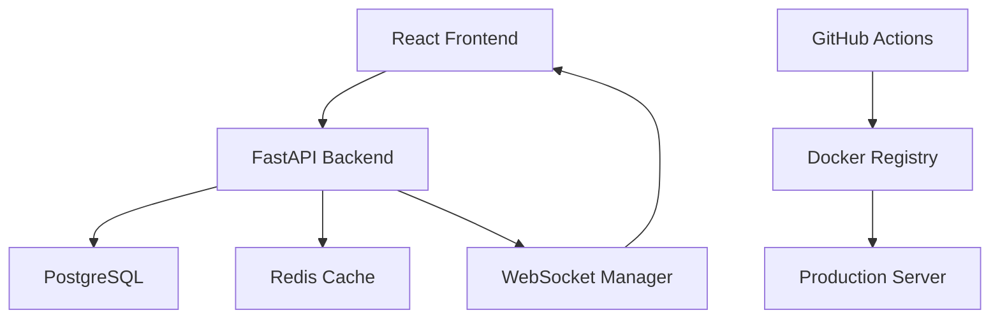

# Arquitectura de Aplicaciones Completas con FastAPI

## 🎯 Objetivo del Módulo

Comprender los principios fundamentales para integrar todas las tecnologías aprendidas en las 10 semanas anteriores en una aplicación profesional completa.

## 📋 Contenido

1. [Principios de Integración](#principios-de-integración)
2. [Arquitectura de Aplicación Completa](#arquitectura-de-aplicación-completa)
3. [Patrones de Diseño Aplicados](#patrones-de-diseño-aplicados)
4. [Documentación Técnica Profesional](#documentación-técnica-profesional)
5. [Preparación para Portfolio](#preparación-para-portfolio)

---

## 1. Principios de Integración

### 🔄 **Concepto de Sistema Integrado**

Un sistema integrado combina múltiples tecnologías de forma cohesiva para crear una aplicación funcional y escalable.

**Características de una buena integración:**

- **Cohesión**: Cada componente tiene una responsabilidad clara
- **Acoplamiento bajo**: Los módulos son independientes
- **Escalabilidad**: Puede crecer sin reestructuración completa
- **Mantenibilidad**: Código limpio y bien documentado

### 🏗️ **Stack Tecnológico Integrado**

```
┌─────────────────────────────────────────┐
│               Frontend                  │
│    React + Vite + Tailwind CSS          │
└─────────────────┬───────────────────────┘
                  │ HTTP/WebSocket
┌─────────────────▼───────────────────────┐
│               Backend                   │
│      FastAPI + Pydantic + JWT           │
└─────────────────┬───────────────────────┘
                  │ SQLAlchemy ORM
┌─────────────────▼───────────────────────┐
│             Base de Datos               │
│          PostgreSQL + Redis             │
└─────────────────────────────────────────┘
```

### 🎯 **Objetivos de Integración**

1. **Funcionalidad Completa**: Todas las features funcionan end-to-end
2. **Performance Adecuado**: Tiempos de respuesta aceptables
3. **Seguridad Implementada**: Autenticación y autorización funcionando
4. **Testing Comprehensivo**: Coverage de funcionalidades críticas
5. **Deployment Ready**: Containerizado y listo para producción

---

## 2. Arquitectura de Aplicación Completa

### 🏛️ **Arquitectura en Capas**

```
┌─────────────────────────────────────────┐
│        Presentation Layer               │
│     (React Components + Pages)          │
└─────────────────┬───────────────────────┘
                  │
┌─────────────────▼───────────────────────┐
│         API Layer                       │
│    (FastAPI Routes + Middleware)        │
└─────────────────┬───────────────────────┘
                  │
┌─────────────────▼───────────────────────┐
│       Business Logic Layer              │
│     (Services + Domain Logic)           │
└─────────────────┬───────────────────────┘
                  │
┌─────────────────▼───────────────────────┐
│        Data Access Layer                │
│    (SQLAlchemy Models + Repositories)   │
└─────────────────┬───────────────────────┘
                  │
┌─────────────────▼───────────────────────┐
│         Data Layer                      │
│      (PostgreSQL + Redis)               │
└─────────────────────────────────────────┘
```

### 📁 **Estructura de Proyecto Profesional**

```
task-manager-app/
├── backend/
│   ├── app/
│   │   ├── api/                 # Endpoints REST
│   │   ├── core/               # Configuración y seguridad
│   │   ├── models/             # Modelos SQLAlchemy
│   │   ├── schemas/            # Esquemas Pydantic
│   │   ├── services/           # Lógica de negocio
│   │   ├── dependencies/       # Dependencias comunes
│   │   ├── websockets/         # Conexiones tiempo real
│   │   └── main.py            # Aplicación principal
│   ├── tests/                 # Suite de testing
│   ├── migrations/            # Migraciones Alembic
│   ├── Dockerfile
│   └── requirements.txt
├── frontend/
│   ├── src/
│   │   ├── components/        # Componentes React
│   │   ├── pages/            # Páginas de la app
│   │   ├── services/         # Servicios API
│   │   ├── hooks/            # Custom hooks
│   │   └── utils/            # Utilidades
│   ├── public/
│   ├── package.json
│   └── Dockerfile
├── docker-compose.yml
├── .github/workflows/         # CI/CD
└── README.md
```

### 🔗 **Flujo de Datos Completo**

```
User Action → React Component → API Call → FastAPI Route
     ↓
JWT Validation → Service Layer → Database Query → Response
     ↓
JSON Response → React State → UI Update → User Feedback
```

---

## 3. Patrones de Diseño Aplicados

### 🏗️ **Repository Pattern**

**Propósito**: Abstraer el acceso a datos

```python
# repositories/task_repository.py
from sqlalchemy.orm import Session
from typing import List, Optional
from models.task import Task
from schemas.task import TaskCreate, TaskUpdate

class TaskRepository:
    def __init__(self, db: Session):
        self.db = db

    def create(self, task_data: TaskCreate, user_id: int) -> Task:
        task = Task(**task_data.dict(), user_id=user_id)
        self.db.add(task)
        self.db.commit()
        self.db.refresh(task)
        return task

    def get_by_id(self, task_id: int) -> Optional[Task]:
        return self.db.query(Task).filter(Task.id == task_id).first()

    def get_user_tasks(self, user_id: int) -> List[Task]:
        return self.db.query(Task).filter(Task.user_id == user_id).all()
```

### 🎯 **Service Layer Pattern**

**Propósito**: Encapsular lógica de negocio

```python
# services/task_service.py
from repositories.task_repository import TaskRepository
from services.notification_service import NotificationService
from schemas.task import TaskCreate, TaskResponse

class TaskService:
    def __init__(self, repo: TaskRepository, notif_service: NotificationService):
        self.repo = repo
        self.notif_service = notif_service

    async def create_task(self, task_data: TaskCreate, user_id: int) -> TaskResponse:
        # Validaciones de negocio
        if len(task_data.title) < 3:
            raise ValueError("Title must be at least 3 characters")

        # Crear tarea
        task = self.repo.create(task_data, user_id)

        # Notificación en tiempo real
        await self.notif_service.notify_task_created(task)

        return TaskResponse.from_orm(task)
```

### 🔧 **Dependency Injection**

**Propósito**: Gestionar dependencias de forma limpia

```python
# dependencies/services.py
from fastapi import Depends
from sqlalchemy.orm import Session
from dependencies.database import get_db
from repositories.task_repository import TaskRepository
from services.task_service import TaskService

def get_task_repository(db: Session = Depends(get_db)) -> TaskRepository:
    return TaskRepository(db)

def get_task_service(
    repo: TaskRepository = Depends(get_task_repository)
) -> TaskService:
    return TaskService(repo)
```

### 📡 **Observer Pattern (WebSockets)**

**Propósito**: Notificaciones en tiempo real

```python
# websockets/notification_manager.py
from typing import Dict, List
from fastapi import WebSocket

class NotificationManager:
    def __init__(self):
        self.active_connections: Dict[int, List[WebSocket]] = {}

    async def connect(self, websocket: WebSocket, user_id: int):
        await websocket.accept()
        if user_id not in self.active_connections:
            self.active_connections[user_id] = []
        self.active_connections[user_id].append(websocket)

    async def notify_user(self, user_id: int, message: dict):
        if user_id in self.active_connections:
            for connection in self.active_connections[user_id]:
                await connection.send_json(message)
```

---

## 4. Documentación Técnica Profesional

### 📖 **README.md Profesional**

**Estructura recomendada:**

```markdown
# Task Manager App

## 🚀 Overview

Brief description of the application and its main features.

## 🛠️ Tech Stack

- Backend: FastAPI, PostgreSQL, Redis
- Frontend: React, Vite, Tailwind CSS
- DevOps: Docker, GitHub Actions

## ⚡ Quick Start

Step-by-step instructions to run the application locally.

## 🏗️ Architecture

High-level architecture description with diagrams.

## 📚 API Documentation

Link to Swagger docs and main endpoints overview.

## 🧪 Testing

How to run tests and current coverage.

## 🚀 Deployment

Production deployment instructions.

## 🤝 Contributing

Guidelines for contributors.
```

### 📊 **Documentación de API**

**Swagger automático con descripciones:**

```python
from fastapi import FastAPI
from fastapi.openapi.docs import get_swagger_ui_html

app = FastAPI(
    title="Task Manager API",
    description="A comprehensive task management system with real-time features",
    version="1.0.0",
    docs_url="/docs",
    redoc_url="/redoc"
)

@app.post("/tasks/", response_model=TaskResponse, summary="Create a new task")
async def create_task(
    task: TaskCreate,
    current_user: User = Depends(get_current_user),
    service: TaskService = Depends(get_task_service)
):
    """
    Create a new task with the following information:

    - **title**: Task title (required, min 3 characters)
    - **description**: Detailed description (optional)
    - **priority**: Priority level (low, medium, high)
    - **due_date**: Due date in ISO format (optional)
    """
    return await service.create_task(task, current_user.id)
```

### 🏗️ **Diagramas de Arquitectura**

**Herramientas recomendadas:**

- Draw.io para diagramas técnicos
- Mermaid para diagramas en markdown
- Figma para mockups de UI

**Ejemplo con Mermaid:**



---

## 5. Preparación para Portfolio

### 🎯 **Elementos Clave del Portfolio**

1. **Demostración en Vivo**

   - Aplicación desplegada y accesible
   - URL funcional con HTTPS
   - Datos de prueba disponibles

2. **Código Fuente Profesional**

   - Repositorio GitHub bien organizado
   - README completo con instrucciones
   - Código limpio y comentado
   - Tests automatizados

3. **Documentación Técnica**
   - Explicación de decisiones arquitecturales
   - Diagramas de la aplicación
   - Instrucciones de deployment
   - API documentation

### 📸 **Screenshots y Demos**

**Elementos visuales importantes:**

- Dashboard principal
- Funcionalidades clave en acción
- Responsive design en móvil
- Features en tiempo real funcionando

### 🏆 **Destacar Skills Técnicas**

**En el README, incluir:**

```markdown
## 🛠️ Technical Skills Demonstrated

### Backend Development

- ✅ RESTful API design with FastAPI
- ✅ Database modeling with SQLAlchemy
- ✅ Authentication with JWT
- ✅ Real-time features with WebSockets
- ✅ Background task processing
- ✅ Comprehensive testing with pytest

### Frontend Development

- ✅ Modern React with hooks
- ✅ Responsive design with Tailwind CSS
- ✅ State management
- ✅ API integration

### DevOps & Deployment

- ✅ Containerization with Docker
- ✅ CI/CD with GitHub Actions
- ✅ Production deployment
```

### 🎤 **Preparación para Presentación**

**Estructura de demo (10 minutos):**

1. **Introducción** (1 min)

   - Qué hace la aplicación
   - Tecnologías utilizadas

2. **Demo de Funcionalidades** (6 min)

   - Registro/Login
   - CRUD de tareas
   - Features en tiempo real
   - Responsive design

3. **Explicación Técnica** (2 min)

   - Arquitectura general
   - Decisiones técnicas clave

4. **Q&A** (1 min)
   - Preguntas y respuestas

**Tips para la presentación:**

- Tener datos de prueba preparados
- Ensayar el flujo de demo
- Preparar respuestas para preguntas técnicas comunes
- Tener backup plan si algo falla

---

## 🎯 Resumen de Conceptos Clave

### ✅ **Integración Exitosa Requiere:**

1. **Arquitectura Clara**: Separación de responsabilidades
2. **Patrones Consistentes**: Repository, Service Layer, DI
3. **Documentación Completa**: README, API docs, comentarios
4. **Testing Adequate**: Coverage de funcionalidades críticas
5. **Deployment Funcional**: Aplicación accesible en producción

### 🚀 **Portfolio Profesional Incluye:**

1. **Aplicación Funcional**: Demostrable y accesible
2. **Código Limpio**: Bien estructurado y documentado
3. **Documentación Técnica**: README completo y diagramas
4. **Skills Demostradas**: Lista clara de competencias técnicas
5. **Presentación Efectiva**: Demo preparado y explicación técnica

---

## 📚 Recursos Adicionales

### **Documentación Técnica**

- [FastAPI Best Practices](https://fastapi.tiangolo.com/tutorial/bigger-applications/)
- [React Project Structure](https://react.dev/learn/thinking-in-react)
- [Clean Architecture](https://blog.cleancoder.com/uncle-bob/2012/08/13/the-clean-architecture.html)

### **Portfolio y Presentación**

- [GitHub Portfolio Guide](https://docs.github.com/en/account-and-profile/setting-up-and-managing-your-github-profile)
- [Technical Presentation Tips](https://speakerdeck.com/)
- [API Documentation Best Practices](https://swagger.io/resources/articles/best-practices-in-api-documentation/)

---

**💡 El objetivo es demostrar que pueden integrar múltiples tecnologías en una aplicación profesional funcional.**
